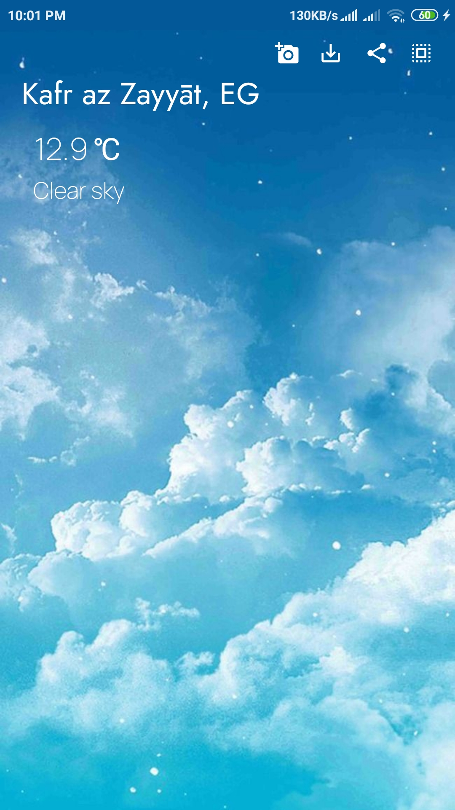

# Weather
  ## Get current weather according to your location with help of [Weather API](https://openweathermap.org/)
  ## also you can save image and share it across all applications.
     
     • Kotlin
     • Dagger-Hilt
     • Room Database
     • Navigation Component
     • Coroutines
     • Databinding
     • Retrofit
     • MVVM
     • LiveData
     • Repository Pattern

  

